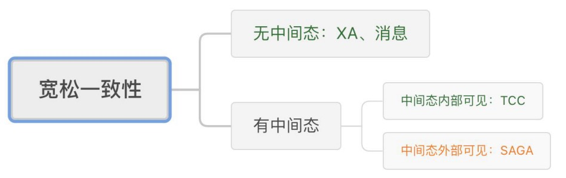
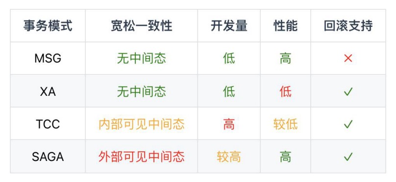

# dtm

[文档](https://dtm.pub/practice/saga.html)
[官方案例](https://github.com/dtm-labs/dtm-examples)


- 事务分类

内部分布式事务：分布式数据库(Spanner, TiDB)跨节点的内部事务

异构分布式事务：跨服务、跨数据库的事务

- 分布式事务实际应用中的ACID

原子性：严格遵循，采用类似UNDO的方式实现

一致性：完成后的一致性严格遵循；事务中的一致性可适当放宽。一致性分类如下


隔离性：大量事务可以并行

持久性：严格遵循，与本地事务一样


一致性由强到弱分别是：XA事务>TCC>二阶段消息>SAGA


```
不一致窗口短：XA和TCC在理想的情况下，可以做到不一致的窗口时间很短
不一致窗口长：SAGA和MSG则缺少控制不一致窗口时间的方法，相对来说会更长
XA：XA虽然不是强一致，但是XA的一致性是多种分布式事务中，一致性最好的，因为他处于不一致的状态时间很短，只有一部分分支开始commit，但还没有全部commit的这个时间窗口，数据是不一致的。因为数据库的commit操作耗时，通常是10ms内，因此不一致的窗口期很短。
TCC：理论上，TCC可以用XA来实现，例如Try-Prepare，Confirm-Commit，Cancel-Rollback。但绝大多数时候，TCC会在业务层自己实现Try|Confirm|Cancel，因此Confirm操作耗时，通常高于XA中的Commit，不一致的窗口时间比XA长
MSG：二阶消息型事务在第一个操作完成后，在所有操作完成之前，这个时间窗口是不一致的，持续时长一般比前两者更久。
SAGA：SAGA的不一致窗口时长与消息接近，但是如果发生回滚，而子事务中正向操作修改的数据又会被用户看到，这部分数据就是错误数据，容易给用户带来较差的体验，因此一致性是最差的
```

- 如何选择事务模式



1、MSG(消息模式): 适合不需要回滚的场景，适合可靠消息模式

eg:假设您有一个活动业务，用户点击领取按钮后。同时领取一张优惠券，和一个月的会员

2、saga(事务消息模式): 适合需要回滚的场景,根据成功与否，进行下一个操作

eg:预定酒店和机票操作需要较长时间确认,持续时间较长

3、tcc事务模式: 适合一致性要求较高的场景

eg: 跨行转账，分别修改余额,用户不希望看到不正常的资金变动


4、xa事务模式: 适合并发要求不高，没有数据库行锁争抢的场景

eg: 只要并发不高，数据修改的冲突不大。前面的TCC都可以采用XA事务模式


- 运行dtm
```
docker run -itd  --name dtm -p 36789:36789 -p 36790:36790  yedf/dtm:latest
```
