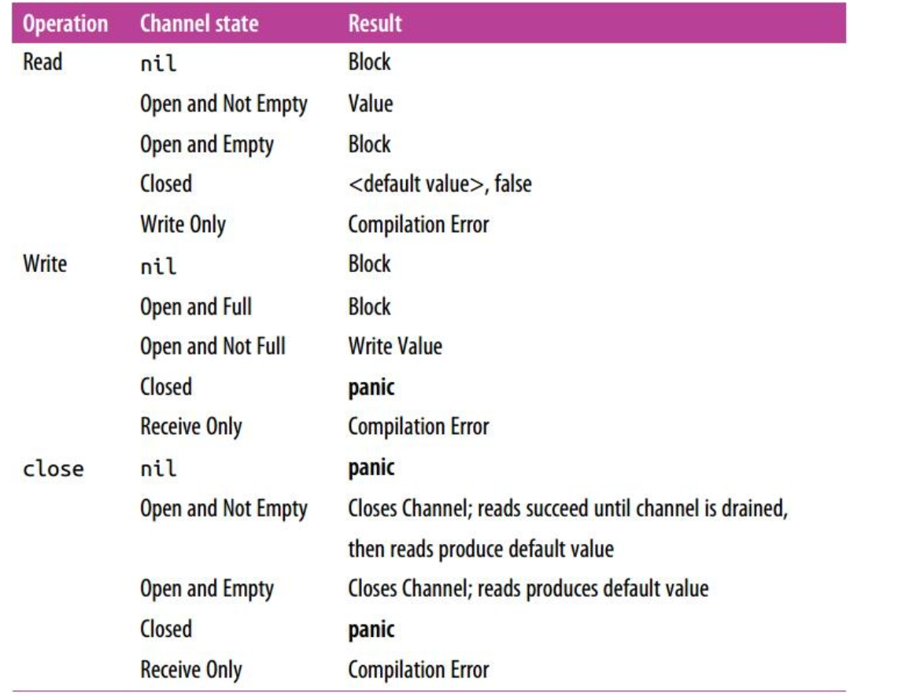

知识点

- select遇到close状态的chanel，会立马返回
- channel close后，状态是close，不是nil
- select不会选中nil的channel（读写两种）
- for select 里面的break默认只能跳select，跳出for需要指定标签,goto与break的区别是会再次执行for
- select 多个case同时达到条件，则随机选择case执行
- select case return时，其他case可能还在写，没办法做到实时关闭
- range循环一个通道的话，当通道被关闭后，range就会结束。没有关闭的话会一直阻塞